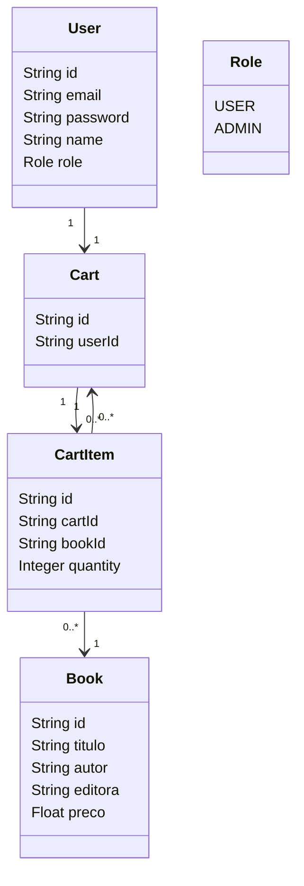

# Livraria online - Projeto Descodificadas



### Explicação das Classes e Relações

1. **Book**: Representa os livros na livraria.
2. **User**: Representa os usuários (admin e comuns).
3. **Cart**: Representa o carrinho de compras, que pertence a um único usuário.
4. **CartItem**: Representa os itens dentro de um carrinho, vinculando livros ao carrinho.
5. **Role**: Enumeração para diferenciar entre usuários comuns e administradores.

### Detalhes das Relações

- **User e Cart**: Um usuário tem um carrinho.
- **Cart e CartItem**: Um carrinho pode ter múltiplos itens.
- **CartItem e Book**: Um item do carrinho está vinculado a um livro específico.

### Testando

1. **Inicie o Servidor dentro da pasta /api**:
    - Execute o comando:

      ```sh
      npm run dev
      ```

2. **Use o Postman**:
    - Para criar um carrinho (`POST /cart`), adicione o `userId` no corpo.
    - Para obter um carrinho (`GET /cart/:userId`), forneça o `userId` na URL.
    - Para deletar um carrinho (`DELETE /cart/:cartId`), forneça o `cartId` na URL.
    - Para criar um item de carrinho (`POST /cart-items`), adicione `cartId`, `bookId` e `quantidade` no corpo.
    - Para deletar um item de carrinho (`DELETE /cart-items/:id`), forneça o `id` na URL.


## Tecnologias Utilizadas

### Backend
- JavaScript
- Prisma ORM
- MongoBD

### Frontend
- React
- Axios